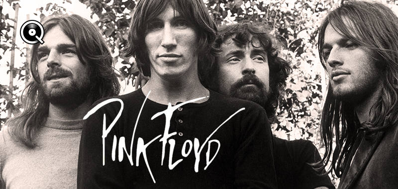

```{r setup, include=FALSE}
knitr::opts_chunk$set(echo = TRUE)
library(tidyverse)
library(spotifyr)
library(ggplot2)
library(dplyr)
library(compmus)
library(plotly)
library(lubridate)
library(cowplot)
```

## 12066664 Computational Musicology Portfolio

<!-- Week 10: Tempograms -->
### **NEW:** Comparing **tempo** in typical and atypical Pink Floyd tracks.
```{r, cache=TRUE, figures-side, fig.show="hold", out.width="50%", fig.align="top", echo=FALSE}
# Set the memory limit to allow tempograms:
# memory.limit(size = 35000) 

species <- get_tidy_audio_analysis("6mKubLaKaqlt0zcuzS6WhH")
breathe <- get_tidy_audio_analysis("3zJRvtQkHQRTNEXSY8jQPR")

species %>% # Non-cyclic tempogram
  tempogram(window_size = 8, hop_size = 1, cyclic = TRUE) %>%
  ggplot(aes(x = time, y = bpm, fill = power)) +
  geom_raster() +
  scale_fill_viridis_c(guide = "none") +
  labs(x = "Time (s)", y = "Tempo (BPM)", title="Several Species (...)") +
  theme_classic()

breathe %>% # Non-cyclic tempogram
  tempogram(window_size = 8, hop_size = 1, cyclic = TRUE) %>%
  ggplot(aes(x = time, y = bpm, fill = power)) +
  geom_raster() +
  scale_fill_viridis_c(guide = "none") +
  labs(x = "Time (s)", y = "Tempo (BPM)", title="Breathe (In The Air)") +
  theme_classic()
```

***
Comparing the tempograms for *Several Species* and *Breathe*, which are very atypical and typical Pink Floyd songs respectively, brings light to several interesting things. Firstly, the tempo for *Several Species* is relatively constant and pronounced at around **85 BPM** from about **25 to 140 seconds**. This is due to this section containing the closest thing to percussion this song has, namely the rhythmic scurrying and tapping of several species of small furry animals. The rest of the song does not produce nearly as pronounced a tempo. Compare this to *Breathe* which does have a more pronounced tempo of about **125 BPM** throughout the song. 

Secondly, although both songs have at least a section with a steady BPM, *Several Species* also has a lot of high intensity spots at seemingly random points away from the main tempo line. This is especially pronounced **outside of the 25 to 140 second** range. This contrasts heavily with *Breathe* which comparatively has very little noise, with the bridge at **120 seconds** being by far the noisiest.


<!-- Week 9: Key and chord estimation -->
### Comparing **keys** used in a selection Pink Floyd's **experimental and popular albums** using standard pitch class notation.
```{r, echo=FALSE}
floyd_keys <-
  get_playlist_audio_features(
    "Pink Floyd all albums (old to new)",
    "1C9XFTKsUqn6U3ZsF8KL4A"
  ) %>%
  slice(1:78) %>%  # Limit to 30 tracks
  add_audio_analysis()

umma <- filter(floyd_keys, track.album.name == "Ummagumma (2011 Remastered Version)") 

dark <- filter(floyd_keys, track.album.name == "The Dark Side Of The Moon [Remastered] (Remastered Version)")

ummadark <- rbind(umma, dark)

# print(floyd_keys)
# print(umma)
# print(dark)
# print(ummadark)

ggplot(ummadark, aes(x=key, fill=track.album.name)) +
  geom_histogram(alpha=0.5, position = 'identity', bins=12) +
  scale_fill_discrete(name = "Album Name", labels = c("The Dark Side Of The Moon", "Ummagumma")) +
  labs(
    title = "Key counts for Ummagumma and The Dark Side Of The Moon",
    x = "Key",
    y = "Count"
  )
  # + scale_x_discrete(labels=c("0" = "Dose 0.5", 
  #                           "1" = "",
  #                           "2" = "",
  #                           "3" = "",
  #                           "4" = "",
  #                           "5" = "",
  #                           "6" = "",
  #                           "7" = "",
  #                           "8" = "",
  #                           "9" = "",
  #                           "10" = "",
  #                           "11" = "",))     # Add chord names
  
```

***
The graph shows 1969's *Ummagumma's* songs having spikes in key count for key 7 and 9, whereas *The Dark Side Of The Moon's* keys (from here on referred to as *Dark Side*) are spread pretty evenly. This is difference likely caused in part by the fact that *Ummagumma* is very experimental. Some songs are barely songs. This is reflected in Spotify's confidence scores for its key estimation of *Ummagumma*, which are far lower than those of *Dark Side*. 


P.S. I planned to plot aforementioned confidence scores along side this histogram, but I could not get it to work properly yet. Will add it soon, hopefully.


<!-- Week 8: Structure analysis, self-similarity matrices -->
### **Self-similarity** in *Several Species Of Small Furry Animals Gathered Together In A Cave And Grooving With A Pict*
<!-- TODO fix figure sizes and alignments -->
```{r, fig.show="hold", out.width="50%", fig.align="top", echo=FALSE}
sevspec <-
  get_tidy_audio_analysis("6mKubLaKaqlt0zcuzS6WhH") %>% # Change URI.
  compmus_align(bars, segments) %>%                     # Change `bars`
  select(bars) %>%                                      #   in all three
  unnest(bars) %>%                                      #   of these lines.
  mutate(
    pitches =
      map(segments,
        compmus_summarise, pitches,
        method = "rms", norm = "euclidean"              # Change summary & norm.
      )
  ) %>%
  mutate(
    timbre =
      map(segments,
        compmus_summarise, timbre,
        method = "rms", norm = "euclidean"              # Change summary & norm.
      )
  )

sevspec_chroma <- sevspec %>%
  compmus_self_similarity(pitches, "euclidean") %>% 
  ggplot(
    aes(
      x = xstart + xduration / 2,
      width = xduration,
      y = ystart + yduration / 2,
      height = yduration,
      fill = d
    )
  ) +
  geom_tile() +
  coord_fixed() +
  scale_fill_viridis_c(guide = "none") +
  theme_classic() +
  labs(x = "", y = "", title = "Chroma-Based Self Similarity")

sevspec_timbre <- sevspec %>%
  compmus_self_similarity(timbre, "euclidean") %>% 
  ggplot(
    aes(
      x = xstart + xduration / 2,
      width = xduration,
      y = ystart + yduration / 2,
      height = yduration,
      fill = d
    )
  ) +
  geom_tile() +
  coord_fixed() +
  scale_fill_viridis_c(guide = "none") +
  theme_classic() +
  labs(x = "", y = "", title = "Timbre-Based Self Similarity") +
  scale_x_continuous(
    breaks = c(26, 69, 138, 224, 272),
    labels = c("Scurrying", "Come Back", "Singing Animals", "Pict", "Avant-Garde")
  ) +
  theme(
        axis.text.x = element_text(angle=90, hjust="1")
  )

sevspec_chroma
sevspec_timbre
```

***
The most experimental song by Pink Floyd has to be *Several Species Of Small Furry Animals Gathered Together In A Cave And Grooving With A Pict* from their 1969 album *Ummagumma*. This track (hereby referred to as *Several Species*) is barely even classifiable as a song. It consists of a few minutes of human imitations of animal noises played at various speeds, and ends with a Pict angrily reciting a poem in an exaggerated Scottish accent. To provide some context, the Picts were the people originally from what is now Scotland. 

This song is not built up of sections, such as verse, chorus and bridge, that are normally seen in pop songs and in most of Pink Floyd's songs too. As such, a couple of key moments in the song have been marked in the timbre-based self-similarity plot. The plots show that *Several Species* starts off quiet. After about 20 seconds the first animals can be heard and at 26 seconds scurrying noises start. These scurrying noises are heard throughout almost the entire song at various loudness levels. From 69 seconds a loop of "Come back" followed by a screech gets layered on top of the scurrying and other random animal noises. At 138 seconds the "Come back" and screech have faded out and 'singing' animals can be heard instead. These do not sing as consistently as the "Come back" and screech were. This is reflected in the plots: The section between Come Back and Singing Animals is mostly uniform, whereas the section between Singing Animals and Pict shows smaller uniform sections that are distinct from each other. At 224 seconds the pict starts his recital of a poem, which can be found [in this Reddit comment](https://www.reddit.com/r/pinkfloyd/comments/5nufpd/what_is_pink_floyds_weirdest_song/dcepows/). During this time, most of the animals noises are absent. Near the end of the Pict's ramblings, at 272 seconds, the phrase "That was pretty avant-garde, wasn' it?" can be heard. The track ends with a few more exclamations by the Pict, after which it fades out again.

Noteworthy is the fact that the marked sections begin at the aforementioned timestamps, they start quiet and grow to full loudness over a period of a few seconds, between about 5 and 10 seconds. This is shown in the graphs, where the sections are distinctly visible, albeit a few seconds past the supplied marker.


<!-- Week 5: Corpus choice -->
### On the **evolution of Pink Floyd's** studio works throughout time.

I've chosen to use the fifteen studio albums by Pink Floyd (see list below) for a few reasons. First off, I really like (most of) their music and I listen to it often. Furthermore, I would like to analyse the differences in style between albums and how that may or may not have changed over time. It could also be interesting to try to find out which properties made some albums more popular than others. I think only using the studio albums suits these ends better than also using the live or collection albums, as the latter bring different versions of songs already on the studio albums and introduce stylistic differences from non-band members playing in the live performances.
<br>
<br>
Some albums that contain very atypical songs are albums such as Ummagumma early on, which was.. 'experimental', as well as the stylistic shift that happened right around Animals and The Wall, where Waters started pulling in a different direction from Gilmour. Specific songs that might be typical or atypical will be looked at further.

<br>
<br> 

<center>

{width=60%}

</center>

***
List of studio albums used (oldest to newest):

1. The Piper at the Gates of Dawn (1967)
2. A Saucerful of Secrets (1968)
3. More (1969)
4. Ummagumma (1969)
5. Atom Heart Mother (1970)
6. Meddle (1971)
7. Obscured by Clouds (1972)
8. The Dark Side of the Moon (1973)
9. Wish You Were Here (1975)
10. Animals (1977)
11. The Wall (1979)
12. The Final Cut (1983)
13. A Momentary Lapse of Reason (1987)
14. The Division Bell (1994)
15. The Endless River (2014)


<!-- Week 6: Fourier analysis, Data visualization -->
### The evergrowing **scepticism** of Pink Floyd represented in their albums becoming **less and less valent**.

```{r, echo=FALSE}
corpus_feat <- get_playlist_audio_features("", "1C9XFTKsUqn6U3ZsF8KL4A")
# print(as_tibble(corpus_feat))

valence_means <- aggregate(corpus_feat[15], list(corpus_feat$track.album.release_date), mean)
#valence_means

energy_means <- aggregate(corpus_feat[7], list(corpus_feat$track.album.release_date), mean)
#energy_means

v_e_means <- merge(valence_means, energy_means)
# v_e_means

floyd <- ggplot() +
  geom_point(data=corpus_feat, aes(x=year(track.album.release_date), y=valence, size=energy, alpha=0.5,
    text = paste(" Name: ", track.name, "\n",
                 "Album: ", track.album.name, "\n",
                 "Valence: ", valence, "\n",
                 "Energy: ", energy))) +
  geom_point(data=v_e_means, aes(x=year(Group.1), y=valence, size=energy, color='red')) +
  geom_line(data=v_e_means, aes(x=year(Group.1), y=valence, color='red', group=1)) +
  scale_x_discrete() +
  theme(
    axis.text.x = element_text(angle=30, hjust="1")
  ) +
  labs(
    title = "Valence and Energy for Songs on Studio Albums by Pink Floyd",
    x = "Album Release Date",
    y = "Valence"
  ) +
  guides(
    alpha = FALSE,
    fill = FALSE,
    color = FALSE
  )

# corpus_feat

ggplotly(floyd, tooltip = 'text')
    
```

***
As a first step in the analysis of the change in style in Pink Floyd's albums I've decided to look at the valence and energy levels in Pink Floyd's songs. Valence describes *musical positiveness* in a track. I have posited that energy levels are also, albeit in a lesser amount, related to *musical positiveness*; positive tracks tend to be more upbeat and louder than sad, slow and quiet songs. To this end I have plotted the valence of songs per album (Figure 1.). Additionally, the energy levels for each song is represented in the size of its point. Lastly, I have plotted the mean valence of all songs on an album, whose size represents the mean energy level of songs on that album. The means are connected to show the trend over time. Although the change over time is small, there does seem to be a small trend toward lower valence, from about $0.38$ to $0.20$. This is most clearly reflected in the album from $1967$ and those from $1971$ to $2014$.
Contrary to my prediction, energy does not seem to neccesarily be connected to valence: not all big points are at the top, they are evenly distributed.


<!-- Week 7: Audio features, Dynamic time warping (DTW) -->
### A nightmarish forest stroll with Pink Floyd: Several Species Of Small Furry Animals Gathered Together In A Cave And Grooving With A Pict.

```{r, echo=FALSE}
wood <-
  get_tidy_audio_analysis("6mKubLaKaqlt0zcuzS6WhH") %>%
  select(segments) %>%
  unnest(segments) %>%
  select(start, duration, pitches)

wood %>%
  mutate(pitches = map(pitches, compmus_normalise, "euclidean")) %>%
  compmus_gather_chroma() %>%
  ggplot(
    aes(
      x = start + duration / 2,
      width = duration,
      y = pitch_class,
      fill = value
    )
  ) +
  geom_tile() +
  labs (
    title = "Chromatogram of 'Several Species (...)', from Ummagumma (1969)",
    x = "Time (s)",
    y = NULL, 
    fill = "Magnitude"
  ) +
  theme_minimal() +
  scale_fill_viridis_c()
  #+ xlim(0, 30) # Set from-to (in seconds) positions in the song.
```

***
Descr TODO