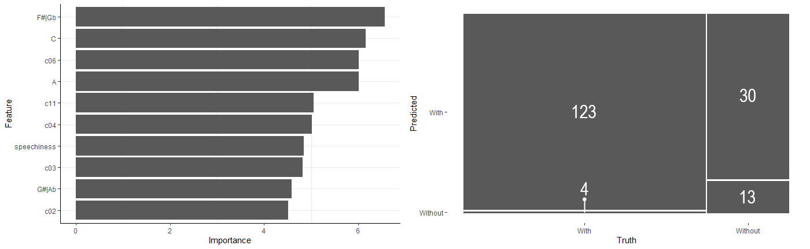

```{r setup, include=FALSE}
knitr::opts_chunk$set(echo = TRUE)
library(tidyverse)
library(spotifyr)
library(ggplot2)
library(dplyr)
library(compmus)
library(plotly)
library(lubridate)
library(cowplot)
library(kknn)
library(C50)
library(tidymodels)
library(ggdendro)
library(heatmaply)
library(lemon)
library(ggpubr)
```

```{r, echo=FALSE}
PF_data <- get_playlist_audio_features("", "1C9XFTKsUqn6U3ZsF8KL4A")

PF_summ <-
  PF_data %>%
    summarise(
      mean_speechiness = mean(speechiness),
      mean_acousticness = mean(acousticness),
      mean_liveness = mean(liveness),
      mean_tempo = mean(tempo),
      sd_speechiness = sd(speechiness),
      sd_acousticness = sd(acousticness),
      sd_liveness = sd(liveness),
      sd_tempo = sd(tempo),
      median_speechiness = median(speechiness),
      median_acousticness = median(acousticness),
      median_liveness = median(liveness),
      median_tempo = median(tempo)
    )

year <- PF_data %>% pull(track.album.release_date)
year <- substr(year, 1, 4)
PF_data$year <- year
rm(year)

month <- PF_data %>% pull(track.album.release_date)
month <- substr(month, 4, 6)
PF_data$month <- month
rm(month)

Waters <- PF_data %>% mutate(year,
               Waters = ifelse(year < 1984, "With", "Without"))
PF_data <- Waters
rm(Waters)

`%nin%` = Negate(`%in%`)
Typi <- PF_data %>% mutate(year,
               Experimental = ifelse(track.album.name %nin% c("Ummagumma (2011 Remastered Version)", 
                                  "Atom Heart Mother (2011 Remastered Version)",
                                  "Meddle (2011 Remastered Version)",
                                  "The Dark Side Of The Moon [Remastered] (Remastered Version)",
                                  "The Wall (Remastered)", "The Endless River"),
                                  "Experimental", "Typical"))
Exp <- PF_data %>% mutate(year,
               Experimental = ifelse(track.album.name %in% c("Ummagumma (2011 Remastered Version)", 
                                  "Atom Heart Mother (2011 Remastered Version)",
                                  "Meddle (2011 Remastered Version)",
                                  "The Dark Side Of The Moon [Remastered] (Remastered Version)",
                                  "The Wall (Remastered)", "The Endless River"),
                                  "Experimental", "Typical"))
PF_data <- Exp
rm(Exp)

PF_audio_anal <- PF_data %>% add_audio_analysis()

# print(as_tibble(PF_data))
```

## 12066664 Computational Musicology Portfolio

<!-- Week 5: Corpus choice -->
### On the **evolution of Pink Floyd's** studio works{data-commentary-width=1200}


***
This project examines the fifteen studio albums by <span style='color:#db4bd2'>Pink Floyd</span> (see list below) to see if a certain events in the history of the band lead to noticeable changes in their music. Although a lot has happened in the history of Pink Floyd, most events, such as the founding member Syd Barett leaving the band under tragic conditions, do not provide enough data to be meaningful in a musicological context. In the case of Barett, this is because he was only present for two albums before leaving. With all that in mind, this analysis sets out to chart changes in Pink Floyd's music over time, mainly with respect to the following: 

* **What effect did Roger Waters leaving in 1984 have on Pink Floyd musically, if any?**
* **How experimental were Pink Floyd throughout their discography?**

I will only be using Floyd's studio albums, as they suits these ends better than additionally using live or collection albums, as those bring different versions of songs already on the studio albums and introduce stylistic differences from non-band members playing in the live performances. Furthermore, the albums I deem experimental are marked (E:) in the list below. *Ummagumma* being marked experimental is likely no surprise to any one who has heard it before; it contains tracks that one can barely even describe as songs. *Atom Heart Mother* and *Meddle* also have a few strange tracks, but mostly see the band experimenting with sounds and in interesting, yet very musical ways. *The Dark Side Of The Moon* is the first time a clear narative is told throughout the album. Roger Waters' brainchild, *The Wall*, a collection of themes that form a medley constructed around the idea of the wall. Lastly, *The Endless River* contains 'unfinished' tracks, and it is also infinite.

List of studio albums used (oldest to newest):

1. The Piper at the Gates of Dawn (1967)
2. A Saucerful of Secrets (1968)
3. More (1969)
4. E: Ummagumma (1969)
5. E: Atom Heart Mother (1970)
6. E: Meddle (1971)
7. Obscured by Clouds (1972)
8. E: The Dark Side of the Moon (1973)
9. Wish You Were Here (1975)
10. Animals (1977)
11. E: The Wall (1979)
12. The Final Cut (1983)
13. A Momentary Lapse of Reason (1987)
14. The Division Bell (1994)
15. E: The Endless River (2014)


<!-- Week 6: Fourier analysis, Data visualization -->
### Are we all just bricks in the wall? Floyd albums becoming **less and less valent**{data-commentary-width=512}
```{r, echo=FALSE}
valence_means <- aggregate(PF_data[15], list(PF_data$track.album.release_date), mean)
#valence_means
energy_means <- aggregate(PF_data[7], list(PF_data$track.album.release_date), mean)
#energy_means
v_e_means <- merge(valence_means, energy_means)
# v_e_means
rm(valence_means)
rm(energy_means)

# print(year(PF_data$track.album.release_date))

floyd <- ggplot() +
  geom_point(data=PF_data, aes(x=year(track.album.release_date), y=valence, size=energy, alpha=0.5,
    text = paste(" Name: ", track.name, "\n",
                 "Album: ", track.album.name, "\n",
                 "Valence: ", valence, "\n",
                 "Energy: ", energy))) +
  geom_point(data=v_e_means, aes(x=year(Group.1), y=valence, size=energy, color='red',
    text = paste(" Mean Valence: ", round(valence, 3), "\n",
                 "Mean Energy: ", round(energy, 3)))) +
  geom_line(data=v_e_means, aes(x=year(Group.1), y=valence, color='red', group=1)) +
  scale_x_discrete() +
  theme_classic() +
  theme(
    axis.text.x = element_text(angle=30, hjust="1")
  ) +
  labs(
    title = "Valence and Energy for Songs on Studio Albums by Pink Floyd",
    x = "Album Release Date",
    y = "Valence"
  ) +
  guides(
    alpha = FALSE,
    fill = FALSE,
    color = FALSE
  ) + 
  geom_vline(xintercept = "1984", color = "black")

ggplotly(floyd, tooltip = 'text')
```

***
As a first step in the analysis of the change in style in Pink Floyd's albums I've decided to look at the valence and energy levels in Pink Floyd's songs. Valence describes *musical positiveness* in a track. I have posited that energy levels are also, albeit in a lesser amount, related to *musical positiveness*; positive tracks tend to be more upbeat and louder than sad, slow and quiet songs. To this end I have plotted the valence of songs per album (Figure 1.). Additionally, the energy levels for each song is represented in the size of its point. Lastly, I have plotted the mean valence of all songs on an album, whose size represents the mean energy level of songs on that album. The means are connected to show the trend over time. Although the change over time is small, there does seem to be a small trend toward lower valence, from about $0.38$ to $0.20$. This is most clearly reflected in the album from $1967$ and those from $1971$ to $2014$.
Contrary to my prediction, energy does not seem to neccesarily be connected to valence: not all big points are at the top, they are evenly distributed. The **departure of Roger Waters** is shown in the line. No meaningful change in valence and energy seems to divide the time with and without Waters.


<!-- Week 8: Structure analysis, self-similarity matrices -->
### Dissecting *Several Species Of Small Furry Animals Gathered Together In A Cave And Grooving With A Pict*: **Self-Similarity**{data-commentary-width=512}
```{r, echo=FALSE}
sevspec <-
  get_tidy_audio_analysis("6mKubLaKaqlt0zcuzS6WhH") %>%
  select(segments) %>%
  unnest(segments) %>%
  select(start, duration, pitches)

sevspec_chr <- sevspec %>%
  mutate(pitches = map(pitches, compmus_normalise, "euclidean")) %>%
  compmus_gather_chroma() %>%
  ggplot(
    aes(
      x = start + duration / 2,
      width = duration,
      y = pitch_class,
      fill = value
    )
  ) +
  geom_tile() +
  labs (
    title = "Chromagram",
    x = "Time (s)",
    y = NULL,
    fill = "Magnitude"
  ) +
  theme_minimal() +
  scale_fill_viridis_c() +
  theme(legend.position="none") +
  geom_vline(xintercept = 26, color="white", linetype="dashed") +
  annotate("text", x=48, y="D#|Eb", label = "S", color ="white", size = 3) +

  geom_vline(xintercept = 69, color="white", linetype="dashed") +
  annotate("text", x=104, y="D#|Eb", label = "CB", color ="white", size = 3) +

  geom_vline(xintercept = 138, color="white", linetype="dashed") +
  annotate("text", x=181, y="D#|Eb", label = "SA", color ="white", size = 3) +

  geom_vline(xintercept = 224, color="white", linetype="dashed") +
  annotate("text", x=262, y="D#|Eb", label = "P", color ="white", size = 3) 

sevspec2 <-
  get_tidy_audio_analysis("6mKubLaKaqlt0zcuzS6WhH") %>% # Change URI.
  compmus_align(bars, segments) %>%                     # Change `bars`
  select(bars) %>%                                      #   in all three
  unnest(bars) %>%                                      #   of these lines.
  mutate(
    pitches =
      map(segments,
        compmus_summarise, pitches,
        method = "rms", norm = "euclidean"              # Change summary & norm.
      )
  ) %>%
  mutate(
    timbre =
      map(segments,
        compmus_summarise, timbre,
        method = "rms", norm = "euclidean"              # Change summary & norm.
      )
  )

sevspec_chroma <- sevspec2 %>%
  compmus_self_similarity(pitches, "euclidean") %>%
  ggplot(
    aes(
      x = xstart + xduration / 2,
      width = xduration,
      y = ystart + yduration / 2,
      height = yduration,
      fill = d
    )
  ) +
  geom_tile() +
  coord_fixed() +
  scale_fill_viridis_c(guide = "none") +
  theme_classic() +
  labs(x = "", y = "", title = "Chroma-Based SSM") +
  geom_segment(aes(x=26, y=0, xend=26, yend=26, colour="a"), linetype="dashed") +
  geom_segment(aes(x=0, y=26, xend=26, yend=26, colour="a"), linetype="dashed") +
  annotate("text", x=26, y=48, label = "S", color ="white", size = 3) +

  geom_segment(aes(x=69, y=0, xend=69, yend=69, colour="a"), linetype="dashed") +
  geom_segment(aes(x=0, y=69, xend=69, yend=69, colour="a"), linetype="dashed") +
  annotate("text", x=69, y=104, label = "CB", color ="white", size = 3) +

  geom_segment(aes(x=138, y=0, xend=138, yend=138, colour="a"), linetype="dashed") +
  geom_segment(aes(x=0, y=138, xend=138, yend=138, colour="a"), linetype="dashed") +
  annotate("text", x=138, y=181, label = "SA", color ="white", size = 3) +

  geom_segment(aes(x=224, y=0, xend=224, yend=224, colour="a"), linetype="dashed") +
  geom_segment(aes(x=0, y=224, xend=224, yend=224, colour="a"), linetype="dashed") +
  annotate("text", x=224, y=262, label = "P", color ="white", size = 3) +

  scale_color_manual(values=c("white")) +
  guides(
    colour=FALSE
  )

sevspec_timbre <- sevspec2 %>%
  compmus_self_similarity(timbre, "euclidean") %>%
  ggplot(
    aes(
      x = xstart + xduration / 2,
      width = xduration,
      y = ystart + yduration / 2,
      height = yduration,
      fill = d
    )
  ) +
  geom_tile() +
  coord_fixed() +
  scale_fill_viridis_c(guide = "none") +
  theme_classic() +
  labs(x = "", y = "", title = "Timbre-Based SSM") +
  geom_segment(aes(x=26, y=0, xend=26, yend=26, colour="a"), linetype="dashed") +
  geom_segment(aes(x=0, y=26, xend=26, yend=26, colour="a"), linetype="dashed") +
  annotate("text", x=26, y=48, label = "S", color ="white", size = 3) +

  geom_segment(aes(x=69, y=0, xend=69, yend=69, colour="a"), linetype="dashed") +
  geom_segment(aes(x=0, y=69, xend=69, yend=69, colour="a"), linetype="dashed") +
  annotate("text", x=69, y=104, label = "CB", color ="white", size = 3) +

  geom_segment(aes(x=138, y=0, xend=138, yend=138, colour="a"), linetype="dashed") +
  geom_segment(aes(x=0, y=138, xend=138, yend=138, colour="a"), linetype="dashed") +
  annotate("text", x=138, y=181, label = "SA", color ="white", size = 3) +

  geom_segment(aes(x=224, y=0, xend=224, yend=224, colour="a"), linetype="dashed") +
  geom_segment(aes(x=0, y=224, xend=224, yend=224, colour="a"), linetype="dashed") +
  annotate("text", x=224, y=262, label = "P", color ="white", size = 3) +

  scale_color_manual(values=c("white")) +
  guides(
    colour=FALSE
  )
```

```{r, echo=FALSE}
breathe <-
  get_tidy_audio_analysis("3zJRvtQkHQRTNEXSY8jQPR") %>%
  select(segments) %>%
  unnest(segments) %>%
  select(start, duration, pitches)

breathe_chr <- breathe %>%
  mutate(pitches = map(pitches, compmus_normalise, "euclidean")) %>%
  compmus_gather_chroma() %>%
  ggplot(
    aes(
      x = start + duration / 2,
      width = duration,
      y = pitch_class,
      fill = value
    )
  ) +
  geom_tile() +
  labs (
    title = "Chromagram",
    x = "Time (s)",
    y = NULL,
    fill = "Magnitude"
  ) +
  theme_minimal() +
  scale_fill_viridis_c() +
  theme(legend.position="none") +
  annotate("text", x=40, y="F", label = "I", color ="white", size = 3) +
  geom_vline(xintercept = 80, color="white", linetype="dashed") +
  annotate("text", x=95, y="F", label = "V1", color ="white", size = 3) +
  geom_vline(xintercept = 109, color="white", linetype="dashed") +
  annotate("text", x=116, y="F", label = "C1", color ="white", size = 3) +
  geom_vline(xintercept = 123, color="white", linetype="dashed") +
  annotate("text", x=138, y="F", label = "V2", color ="white", size = 3) +
  geom_vline(xintercept = 153, color="white", linetype="dashed") +
  annotate("text", x=161, y="F", label = "C2", color ="white", size = 3)
  

breathe2 <-
  get_tidy_audio_analysis("3zJRvtQkHQRTNEXSY8jQPR") %>% # Change URI.
  compmus_align(bars, segments) %>%                     # Change `bars`
  select(bars) %>%                                      #   in all three
  unnest(bars) %>%                                      #   of these lines.
  mutate(
    pitches =
      map(segments,
        compmus_summarise, pitches,
        method = "rms", norm = "euclidean"              # Change summary & norm.
      )
  ) %>%
  mutate(
    timbre =
      map(segments,
        compmus_summarise, timbre,
        method = "rms", norm = "euclidean"              # Change summary & norm.
      )
  )

breathe_chroma <- breathe2 %>%
  compmus_self_similarity(pitches, "euclidean") %>%
  ggplot(
    aes(
      x = xstart + xduration / 2,
      width = xduration,
      y = ystart + yduration / 2,
      height = yduration,
      fill = d
    )
  ) +
  geom_tile() +
  coord_fixed() +
  scale_fill_viridis_c(guide = "none") +
  theme_classic() +
  labs(x = "", y = "", title = "Chroma-Based SSM") +
  geom_segment(aes(x=80, y=0, xend=80, yend=80, colour="a"), linetype="dashed") +
  geom_segment(aes(x=0, y=80, xend=80, yend=80, colour="a"), linetype="dashed") +
  annotate("text", x=80, y=95, label = "V1", color ="white", size = 3) +

  geom_segment(aes(x=109, y=0, xend=109, yend=109, colour="a"), linetype="dashed") +
  geom_segment(aes(x=0, y=109, xend=109, yend=109, colour="a"), linetype="dashed") +
  annotate("text", x=109, y=116, label = "C1", color ="white", size = 3) +

  geom_segment(aes(x=123, y=0, xend=123, yend=123, colour="a"), linetype="dashed") +
  geom_segment(aes(x=0, y=123, xend=123, yend=123, colour="a"), linetype="dashed") +
  annotate("text", x=123, y=138, label = "V2", color ="white", size = 3) +

  geom_segment(aes(x=153, y=0, xend=153, yend=153, colour="a"), linetype="dashed") +
  geom_segment(aes(x=0, y=153, xend=153, yend=153, colour="a"), linetype="dashed") +
  annotate("text", x=153, y=161, label = "C2", color ="white", size = 3) +

  scale_color_manual(values=c("white")) +
  guides(
    colour=FALSE
  )

breathe_timbre <- breathe2 %>%
  compmus_self_similarity(timbre, "euclidean") %>%
  ggplot(
    aes(
      x = xstart + xduration / 2,
      width = xduration,
      y = ystart + yduration / 2,
      height = yduration,
      fill = d
    )
  ) +
  geom_tile() +
  coord_fixed() +
  scale_fill_viridis_c(guide = "none") +
  theme_classic() +
  labs(x = "", y = "", title = "Timbre-Based SSM") +
  geom_segment(aes(x=80, y=0, xend=80, yend=80, colour="a"), linetype="dashed") +
  geom_segment(aes(x=0, y=80, xend=80, yend=80, colour="a"), linetype="dashed") +
  annotate("text", x=80, y=95, label = "V1", color ="white", size = 3) +

  geom_segment(aes(x=109, y=0, xend=109, yend=109, colour="a"), linetype="dashed") +
  geom_segment(aes(x=0, y=109, xend=109, yend=109, colour="a"), linetype="dashed") +
  annotate("text", x=109, y=116, label = "C1", color ="white", size = 3) +

  geom_segment(aes(x=123, y=0, xend=123, yend=123, colour="a"), linetype="dashed") +
  geom_segment(aes(x=0, y=123, xend=123, yend=123, colour="a"), linetype="dashed") +
  annotate("text", x=123, y=138, label = "V2", color ="white", size = 3) +

  geom_segment(aes(x=153, y=0, xend=153, yend=153, colour="a"), linetype="dashed") +
  geom_segment(aes(x=0, y=153, xend=153, yend=153, colour="a"), linetype="dashed") +
  annotate("text", x=153, y=161, label = "C2", color ="white", size = 3) +

  scale_color_manual(values=c("white")) +
  guides(
    colour=FALSE
  )
```

<!-- {r, fig.show="hold", out.width="50%", fig.align="top", echo=FALSE} -->

```{r, echo=FALSE}
# ggarrange(sevspec_chr, sevspec_chroma, sevspec_timbre, breathe_chr, breathe_chroma, breathe_timbre,
#           labels = c("1a", "1b", "1c", "2a", "2b", "2c"),
#           ncol = 3, nrow = 2,
#           font.label = list(size = 12, color = "black"))

plot_grid(sevspec_chr, sevspec_chroma, sevspec_timbre, breathe_chr, breathe_chroma, breathe_timbre,
          labels = c("1a", "1b", "1c", "2a", "2b", "2c"),
          nrow=2)
```

***
The most experimental song by Pink Floyd has to be *Several Species Of Small Furry Animals Gathered Together In A Cave And Grooving With A Pict* from their 1969 album *Ummagumma*. This track (hereby referred to as *Several Species*) is barely even classifiable as a song. It consists of a few minutes of human imitations of animal noises played at various speeds, and ends with a Pict angrily reciting a poem in an exaggerated Scottish accent. To provide some context, the Picts were the people originally from what is now Scotland. 

This song is not built up of sections, such as verse, chorus and bridge, that are normally seen in pop songs and in most of Pink Floyd's songs too. As such, a couple of key moments in the song have been marked in the timbre-based self-similarity plot. The plots show that *Several Species* starts off quiet. After about 20 seconds the first animals can be heard and at 26 seconds scurrying noises (S) start. These scurrying noises are heard throughout almost the entire song at various loudness levels. From 69 seconds a loop of "Come back" (CB) followed by a screech gets layered on top of the scurrying and other random animal noises. At 138 seconds the "Come back" and screech have faded out and 'singing' animals (SA) can be heard instead. These do not sing as consistently as the "Come back" and screech were. This is reflected in the plots: the section between Come Back and Singing Animals is mostly uniform, whereas the section between Singing Animals and Pict (P) shows smaller uniform sections that are distinct from each other. At 224 seconds the Pict starts his recital of a poem, which can be found [in this Reddit comment](https://www.reddit.com/r/pinkfloyd/comments/5nufpd/what_is_pink_floyds_weirdest_song/dcepows/). During this time, most of the animals noises are absent. Near the end of the Pict's ramblings, at 272 seconds, the phrase "That was pretty avant-garde, wasn' it?" can be heard. The track ends with a few more exclamations by the Pict, after which it fades out again.

Noteworthy is the fact that the marked sections begin at the aforementioned timestamps, they start quiet and grow to full loudness over a period of a few seconds, between about 5 and 10 seconds. This is shown in the graphs, where the sections are distinctly visible, albeit a few seconds past the supplied marker.

Contrast *Several Species* with *Breathe (In The Air)*. The latter shows a much clearer rythm in the chromagram, and also shows chorus 1 not only being similar with itself, but also with chorus 2: this shows the existence of a chorus at all, something *Several Species* does not have.


### Comparing **timbre coefficients** in Pink Floyd's **experimental and typical albums**{data-commentary-width=512}
```{r, fig.show="hold", out.width="50%", fig.align="top", echo=FALSE}
with_waters <- filter(PF_data, Waters == "With") %>% add_audio_analysis()

wo_waters <- filter(PF_data, Waters == "Without") %>% add_audio_analysis()

with_waters %>%
  mutate(
    timbre =
      map(
        segments,
        compmus_summarise,
        timbre,
        method = "mean"
      )
  ) %>%
  select(Experimental, timbre) %>%
  compmus_gather_timbre() %>%
  ggplot(aes(x = basis, y = value, fill = Experimental)) +
  geom_violin() +
  ylim(-140, 140) +
  theme_bw() +
  theme(strip.background = element_blank(),
        panel.border = element_blank(),
        axis.line = element_line(color="black", size=0.5)) +
  scale_fill_viridis_d() +
  labs(x = "Spotify Timbre Coefficients", y = "",
       title = "Timbre Coefficients in Pink Floyd Songs With Waters", fill = "Album Type")

wo_waters %>%
  mutate(
    timbre =
      map(
        segments,
        compmus_summarise,
        timbre,
        method = "mean"
      )
  ) %>%
  select(Experimental, timbre) %>%
  compmus_gather_timbre() %>%
  ggplot(aes(x = basis, y = value, fill = Experimental)) +
  geom_violin() +
  ylim(-140, 140) +
  theme_bw() +
  theme(strip.background = element_blank(),
        panel.border = element_blank(),
        axis.line = element_line(color="black", size=0.5)) +
  scale_fill_viridis_d() +
  labs(x = "Spotify Timbre Coefficients", y = "",
       title = "Timbre Coefficients in Pink Floyd Songs Without Waters", fill = "Album Type")
```

***
Next I studied the difference in **intensity of the timbre *coefficients** between the albums where Waters was still a member, versus those where he wasn't. The differences for most coefficients are negligible, however the **second and third coefficient** are a lot longer in the set with Waters. The plots also show potential differences between experimental and typical songs, however these are similarly uninteresting, and show no clear difference.


<!-- Week 10: Tempograms -->
### A closer look at **Tempo**{data-commentary-width=512}
```{r, cache=TRUE, figures-side, fig.show="hold", out.width="50%", fig.align="top", echo=FALSE}
# Set the memory limit to allow tempograms:
memory.limit(size = 35000)

species <- get_tidy_audio_analysis("6mKubLaKaqlt0zcuzS6WhH")
breathe <- get_tidy_audio_analysis("3zJRvtQkHQRTNEXSY8jQPR")

species %>% # Non-cyclic tempogram
  tempogram(window_size = 8, hop_size = 1, cyclic = TRUE) %>%
  ggplot(aes(x = time, y = bpm, fill = power)) +
  geom_raster() +
  scale_fill_viridis_c(guide = "none") +
  labs(x = "Time (s)", y = "Tempo (BPM)", title="Several Species...") +
  theme_classic() +
  geom_vline(xintercept = 26, color="white", linetype="dashed") +
  annotate("text", x=48, y=97, label = "S", color ="white", size = 3) +
  geom_vline(xintercept = 69, color="white", linetype="dashed") +
  annotate("text", x=104, y=97, label = "CB", color ="white", size = 3) +
  geom_vline(xintercept = 138, color="white", linetype="dashed") +
  annotate("text", x=181, y=97, label = "SA", color ="white", size = 3) +
  geom_vline(xintercept = 224, color="white", linetype="dashed") +
  annotate("text", x=262, y=97, label = "P", color ="white", size = 3) 

breathe %>% # Non-cyclic tempogram
  tempogram(window_size = 8, hop_size = 1, cyclic = TRUE) %>%
  ggplot(aes(x = time, y = bpm, fill = power)) +
  geom_raster() +
  scale_fill_viridis_c(guide = "none") +
  labs(x = "Time (s)", y = "Tempo (BPM)", title="Breathe (In The Air)") +
  theme_classic() +
  annotate("text", x=40, y=90, label = "I", color ="white", size = 3) +
  geom_vline(xintercept = 80, color="white", linetype="dashed") +
  annotate("text", x=95, y=90, label = "V1", color ="white", size = 3) +
  geom_vline(xintercept = 109, color="white", linetype="dashed") +
  annotate("text", x=116, y=90, label = "C1", color ="white", size = 3) +
  geom_vline(xintercept = 123, color="white", linetype="dashed") +
  annotate("text", x=138, y=90, label = "V2", color ="white", size = 3) +
  geom_vline(xintercept = 153, color="white", linetype="dashed") +
  annotate("text", x=161, y=90, label = "C2", color ="white", size = 3)
```

***
Comparing the tempograms for *Several Species* and *Breathe*, which are very atypical and typical Pink Floyd songs respectively, brings light to several interesting things. Firstly, the tempo for *Several Species* is relatively constant and pronounced at around **85 BPM** from about **25 to 140 seconds**. This is due to this section containing the closest thing to percussion this song has, namely the rhythmic scurrying and tapping of several species of small furry animals. The rest of the song does not produce nearly as pronounced a tempo. Compare this to *Breathe* which does have a more pronounced tempo of about **125 BPM** throughout the song. 

Secondly, although both songs have at least a section with a steady BPM, *Several Species* also has a lot of high intensity spots at seemingly random points away from the main tempo line. This is especially pronounced **outside of the 25 to 140 second** range. This contrasts heavily with *Breathe* which comparatively has very little noise, with the bridge at **120 seconds** being by far the noisiest.


<!-- Week 11: Classification and Clustering -->
### How recognizable is the sound of Waters?{data-commentary-width=512}
```{r, echo=FALSE, fig.align="top"}
# indie_features <-
#   PF_audio_anal %>%  # For your portfolio, change this to the name of your corpus.
#   mutate(
#     water = factor(Waters),
#     segments = map2(segments, key, compmus_c_transpose),
#     pitches =
#       map(
#         segments,
#         compmus_summarise, pitches,
#         method = "mean", norm = "manhattan"
#       ),
#     timbre =
#       map(
#         segments,
#         compmus_summarise, timbre,
#         method = "mean",
#       )
#   ) %>%
#   mutate(pitches = map(pitches, compmus_normalise, "clr")) %>%
#   mutate_at(vars(pitches, timbre), map, bind_rows) %>%
#   unnest(cols = c(pitches, timbre))
# 
# indie_recipe <-
#   recipe(
#     water ~
#       speechiness +
#       C +`F#|Gb` + `G#|Ab` + A +
#       c02 + c03 + c04 + c06 + c11,
#     data = indie_features,          # Use the same name as the previous block.
#   ) %>%
#   step_center(all_predictors()) %>%
#   step_scale(all_predictors())      # Converts to z-scores.
#   # step_range(all_predictors())    # Sets range to [0, 1].
# 
# indie_cv <- indie_features %>% vfold_cv(10)
# 
# forest_model <-
#   rand_forest() %>%
#   set_mode("classification") %>%
#   set_engine("ranger", importance = "impurity")
# indie_forest <-
#   workflow() %>%
#   add_recipe(indie_recipe) %>%
#   add_model(forest_model) %>%
#   fit_resamples(
#     indie_cv,
#     control = control_resamples(save_pred = TRUE)
#   )
# 
# indie_forest %>% get_pr()
# 
# workflow() %>%
#   add_recipe(indie_recipe) %>%
#   add_model(forest_model) %>%
#   fit(indie_features) %>%
#   pluck("fit", "fit", "fit") %>%
#   ranger::importance() %>%
#   enframe() %>%
#   mutate(name = fct_reorder(name, value)) %>%
#   ggplot(aes(name, value)) +
#   geom_col() +
#   coord_flip() +
#   labs(x = "Feature", y = "Importance") +
#   theme_bw() +
#   theme(strip.background = element_blank(), 
#         panel.grid.major.x = element_blank(),
#         panel.border = element_blank(),
#         axis.line = element_line(color="black", size=0.5))
#   
# 
# a <- indie_forest %>% get_conf_mat()
# print(a)
# indie_forest %>% get_conf_mat() %>% autoplot(type = "mosaic")
```
<center>



</center>

***
To further analyze the difference between **albums with Waters and those without**, a classifier was trained. The first iteration used all track-level features spotify has to offer: **danceability** and the like, **cepstrum coefficients** and **key** information. A **random forest classifier** was used as it got similar, yet slightly better results than kNN. To ensure accurate representation of the data and to prevent selection bias, a **10-fold cross validation** was maintained. The table below shows that the model has an **easier time** with **albums on which Waters played** than those on which he was no longer a member. This is likely due to there being $127$ songs with Waters, compared to the $43$ without him, which means the model has more data points to learn the characteristics of a Waters song from.

| Class | Precision | Recall |
|:------:|:-----|:------|
| With Waters | 0.778 | 0.992 |
| Without Waters | 0.875 | 0.163 |
###### Table 1. Performance of random forest model using all features.

In an effort to improve the performance of the model the **10 most important features** were kept, while the rest were discarded. These features are shown in the left-most graph on this page. All other model parameters were kept the same. The table below clearly shows the **tradeoff** that is inherent to the precision and recall measures. As one increases recall, precision decreases and vice versa. This means the overall performance of the model has barely improved, if at all. The table below shows the performance of the revised model, which is graphically represented in the right-most graph on this page. The model seems to be great at recognizing if Waters is in a song, but then again it just almost always guesses Waters, and most of the time it's right. To cut it some slack though, I would not be able to tell, were it not for the fact I know when Waters left.

| Class | Precision | Recall |
|:------:|:-----|:------|
| With Waters | 0.804 | 0.969 |
| Without Waters | 0.765 | 0.302 |
###### Table 2. Performance of random forest model using 10 most imporant features.


### Conclusions{data-commentary-width=512}
In conclusion, although a small decline in overall valence in Floyd songs is discernable, there is not much else in their history that shows itself through their music. The differences are clearly visible at the track level though, especially when comparing tracks from earlier experimental albums to tracks from later, more standard albums.